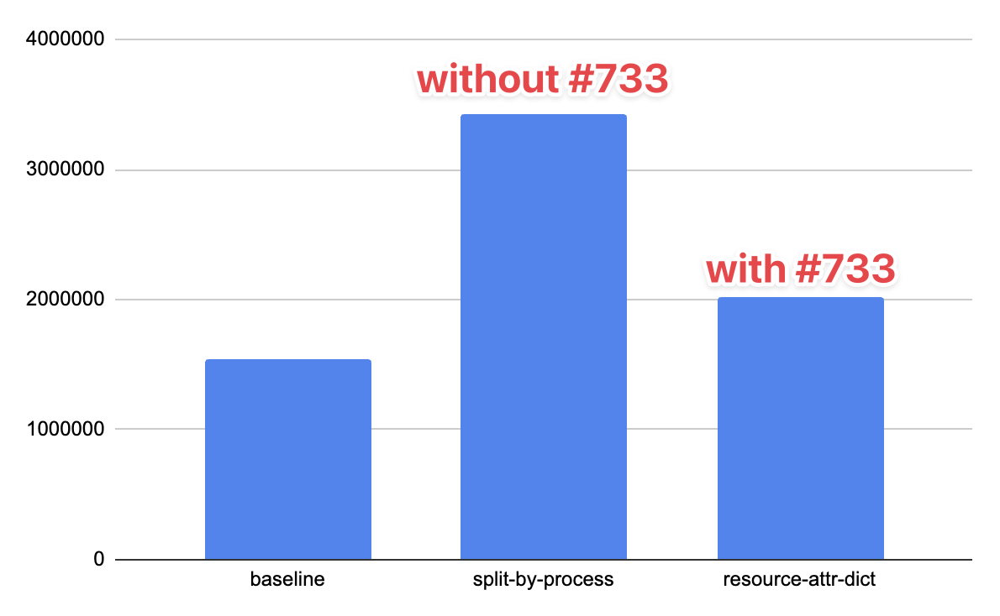

# GH-733 Resource Attribute Dictionary Benchmark

[Felix Geisendörfer](https://github.com/felixge) and [Nayef Ghattas](https://github.com/Gandem) on behalf of the Profiling SIG (`2025-11-27`).

## Summary

PR [#733](https://github.com/open-telemetry/opentelemetry-proto/pull/733) on the `opentelemetry-proto` repository aims to optimize duplicate `Resource` attribute keys and values in the same `ExportProfilesServiceRequest` payload.

The report below concludes that the PR is effective and reduces the uncompressed payload size by `41%` and gzip-6 compressed payload size by `4%` for a k8s workload with frequent process forking when comparing the `split-by-process` vs `resource-attr-dict` approach.

| file                       | encoding           | payloads | uncompressed_bytes | gzip_6_bytes |
|----------------------------|--------------------|----------|--------------------|--------------|
| testdata/k8s_big_fork.otlp | baseline           |       20 |            1546937 |       519968 |
| testdata/k8s_big_fork.otlp | split-by-process   |       20 |            3423158 |       528406 |
| testdata/k8s_big_fork.otlp | resource-attr-dict |       20 |            2021150 |       508097 |

A visualization of the `uncompressed_bytes` column is shown below.



## Background

### baseline

The eBPF profiler currently generates OTLP profiling data with one `Resource` per container. Process attributes (e.g. `process.pid`) are stored on the `Sample` level. The `container.id` is used by the [k8sattributesprocessor](https://github.com/open-telemetry/opentelemetry-collector-contrib/tree/main/processor/k8sattributesprocessor) to add many additional attributes, e.g. `k8s.container.name`.

A simplified example of this is shown below. Note: The `&` character denotes values that are referenced from the `ProfilesDictionary`. See [v1development/profiles.proto](https://github.com/open-telemetry/opentelemetry-proto/blob/1bd04ef77beca4057dcb405c15173a59c838777c/opentelemetry/proto/profiles/v1development/profiles.proto) for details about the OTLP profile format.

```
Resource: container.id="1e82d7e19251ec59126d036da362a7bcf318420c2e5c9be3818ebc5f92873469", k8s.container.name="bar", ...
  Scope: go.opentelemetry.io/ebpf-profiler: 
    Profile: samples=count
      Sample: &process.executable.name="java", &process.executable.path="/usr/local/openjdk-17/bin/java", &process.pid=236982, &thread.id=237382, &thread.name=&"Thread-1"
      Sample: &process.executable.name="node", &process.executable.path="/usr/local/bin/sidecar", &process.pid=236981, &thread.id=237385, &thread.name=&"Thread-5"
      ...
Resource: container.id="6ad3c930c936050866dfe2262244430b843010791d6e3b9dda1b2bf52fbc93df", k8s.container.name="foo", ...
  Scope: go.opentelemetry.io/ebpf-profiler: 
    Profile: samples=count
      Sample: &process.executable.name="PerformanceTest", &process.executable.path="/app/PerformanceTest", &process.pid=236993, &thread.id=236993, &thread.name=&"PerformanceTest"
      Sample: &process.executable.name="node", &process.executable.path="/usr/local/bin/sidecar", &process.pid=236989, &thread.id=237389, &thread.name=&"Thread-5"
      ...
```

However, this is not aligned with the [OpenTelemetry spec](https://opentelemetry.io/docs/specs/otel/resource/) which considers processes to be resources.

### split-by-process

To rectify the situation, Josh, on behalf of the Technical Committee, has recommended that the eBPF profiler should generate OTLP profiling data with one `Resource` per process to align with the SDKs.

This means the example from above would be transformed by moving the process attributes (`process.executable.name`, `process.executable.path`, `process.pid`) to the `Resource` level as shown below:

```
Resource: container.id="1e82d7e19251ec59126d036da362a7bcf318420c2e5c9be3818ebc5f92873469", k8s.container.name="bar", process.executable.name="java", process.executable.path="/usr/local/openjdk-17/bin/java", process.pid=236982, ...
  Scope: go.opentelemetry.io/ebpf-profiler:
    Profile: samples=count
      Sample: &thread.id=237382, &thread.name=&"Thread-1"
Resource: container.id="1e82d7e19251ec59126d036da362a7bcf318420c2e5c9be3818ebc5f92873469", k8s.container.name="bar", process.executable.name="node", process.executable.path="/usr/local/bin/sidecar", process.pid=236981, ...
  Scope: go.opentelemetry.io/ebpf-profiler: 
    Profile: samples=count
      Sample: &thread.id=237385, &thread.name=&"Thread-5"
      ...
Resource: container.id="6ad3c930c936050866dfe2262244430b843010791d6e3b9dda1b2bf52fbc93df", k8s.container.name="foo", process.executable.name="PerformanceTest", process.executable.path="/app/PerformanceTest", process.pid=236993, ...
  Scope: go.opentelemetry.io/ebpf-profiler: 
    Profile: samples=count
      Sample: &thread.id=236993, &thread.name=&"PerformanceTest"
Resource: container.id="6ad3c930c936050866dfe2262244430b843010791d6e3b9dda1b2bf52fbc93df", k8s.container.name="foo", process.executable.name="node", process.executable.path="/usr/local/bin/sidecar", process.pid=236989, ...
  Scope: go.opentelemetry.io/ebpf-profiler: 
    Profile: samples=count
      Sample: &thread.id=237389, &thread.name=&"Thread-5"
      ...
```

### resource-attr-dict

However, this causes a lot of duplication of `Resource` attribute keys and values, e.g. `k8s.container.name`, `process.executable.name`, `process.executable.path`, `process.pid` have their keys and values duplicated in the example above.

To deal with this problem, PR [#733](https://github.com/open-telemetry/opentelemetry-proto/pull/733) suggests to modify `KeyValue` and `AnyValue` messsages to support referencing keys and values from the `ProfilesDictionary` string table. This means the example from above would be transformed like shown below. Note the `&` to indicate dictionary references.

```
Resource: &container.id=&"1e82d7e19251ec59126d036da362a7bcf318420c2e5c9be3818ebc5f92873469", &k8s.container.name=&"bar", &process.executable.name=&"java", &process.executable.path=&"/usr/local/openjdk-17/bin/java", &process.pid=236982, ...
  Scope: go.opentelemetry.io/ebpf-profiler:
    Profile: samples=count
      Sample: &thread.id=237382, &thread.name=&"Thread-1"
Resource: &container.id=&"1e82d7e19251ec59126d036da362a7bcf318420c2e5c9be3818ebc5f92873469", &k8s.container.name=&"bar", &process.executable.name=&"node", &process.executable.path=&"/usr/local/bin/sidecar", &process.pid=236981, ...
  Scope: go.opentelemetry.io/ebpf-profiler: 
    Profile: samples=count
      Sample: &thread.id=237385, &thread.name=&"Thread-5"
      ...
Resource: &container.id=&"6ad330c936050866dfe2262244430b843010791d6e3b9dda1b2bf52fbc93df", &k8s.container.name=&"foo", &process.executable.name=&"PerformanceTest", &process.executable.path=&"/app/PerformanceTest", &process.pid=236993, ...
  Scope: go.opentelemetry.io/ebpf-profiler: 
    Profile: samples=count
      Sample: &thread.id=236993, &thread.name=&"PerformanceTest"
Resource: &container.id=&"6ad3c930c936050866dfe2262244430b843010791d6e3b9dda1b2bf52fbc93df", &k8s.container.name=&"foo", &process.executable.name=&"node", &process.executable.path=&"/usr/local/bin/sidecar", &process.pid=236989, ...
  Scope: go.opentelemetry.io/ebpf-profiler: 
    Profile: samples=count
      Sample: &thread.id=237389, &thread.name=&"Thread-5"
      ...
```

## Benchmark

The proposed change is a rather significant departure from existing OTLP conventions, so stakeholders have understandably been asking to see benchmarks that show the impact of the change.

### Methodology

We approached this problem by collecting data from the eBPF profiler using the existing OTLP format (v1.9.0) and analyzing the impact of the proposed change by transforming the data as described above.

The data was collected from a single-node minikube cluster running two workloads:
* the [OpenTelemetry Demo](https://github.com/open-telemetry/opentelemetry-demo) environment (Astronomy Shop), a multi-service e-commerce application with ~15 microservices in Go, Java, Python, .NET, Node.js, Rust, PHP, and more; and,
* [NetBox](https://github.com/netbox-community/netbox), a Django-based gunicorn WSGI application useful for evaluating profiler behavior with forking Python processes.

A custom OpenTelemetry Collector with the [eBPF profiler](https://github.com/open-telemetry/opentelemetry-ebpf-profiler) captured profiles from all processes on the node and wrote them to disk. For detailed setup instructions, see [bench-setup/README.md](../../bench-setup/README.md).

### Data

The raw data we collected (`*.otlp`) along with the results (`summary.csv`) and intermediate debug output (`*.otlp.<transformation>.txt`) can be downloaded [here](https://drive.google.com/drive/folders/1j4oS4WVw0GgxEryiqlZLUCalDQ_tbDIN?usp=sharing).

### Reproducing

To reproduce the transformations, you can run the following command in this repository's root directory against any collection of `*.otlp` files you have.

```bash
$ cd otlp-bench
$ go run . *.otlp
$ ls -lah otlp-bench-results
# results
```

### Results

Below are the results of the data we have collected. Of these, we consider `testdata/k8s_big_fork.otlp` to be the most representative of the workload we are interested in.

The other workloads were taken from environments with either little or no process forking or a low amount of activity in general. But we are including them here to show that even those workloads show modest benefits from the proposed change.

The `uncompressed_gain` and `gzip_6_gain` columns show the percentage reduction in uncompressed and gzip-6 compressed payload sizes respectively when comparing the `resource-attr-dict` vs `split-by-process` approach.


| file                       | encoding           | payloads | uncompressed_bytes | gzip_6_bytes | uncompressed_gain | gzip_6_gain |
|----------------------------|--------------------|----------|--------------------|--------------|-------------------|-------------|
| testdata/k8s_big_fork.otlp | baseline           |       20 |            1546937 |       519968 |                   |             |
| testdata/k8s_big_fork.otlp | split-by-process   |       20 |            3423158 |       528406 |                   |             |
| testdata/k8s_big_fork.otlp | resource-attr-dict |       20 |            2021150 |       508097 |            40.96% |       3.84% |
| testdata/k8s_big.otlp      | baseline           |        4 |             563633 |       185697 |                   |             |
| testdata/k8s_big.otlp      | split-by-process   |        4 |             805554 |       190498 |                   |             |
| testdata/k8s_big.otlp      | resource-attr-dict |        4 |             603593 |       186018 |            25.07% |       2.35% |
| testdata/k8s.otlp          | baseline           |        2 |              73091 |        28421 |                   |             |
| testdata/k8s.otlp          | split-by-process   |        2 |              76653 |        29135 |                   |             |
| testdata/k8s.otlp          | resource-attr-dict |        2 |              75596 |        28703 |             1.38% |       1.48% |
| testdata/profile.otlp      | baseline           |        1 |              25115 |        10083 |                   |             |
| testdata/profile.otlp      | split-by-process   |        1 |              26795 |        10265 |                   |             |
| testdata/profile.otlp      | resource-attr-dict |        1 |              25536 |        10208 |             4.70% |       0.56% |

## Discussion

### The gzip-6 gains are modest

Yes, the gzip-6 gains are modest.

But this is expected, since `resource-attr-dict` is essentially applying a compression technique (dictionary encoding) to the data.

However, the uncompressed gains are significant, and we expect the cost of gzip compression and decompression to significantly benefit as a result. Perhaps more importantly, the uncompressed gains will also translate into a lower memory footprint and less CPU usage for decoding OTLP in the collector or other receivers.

### What about per-resource dictionaries?

Bogdan suggested that we should consider using per-resource `ProfilesDictionary` to simplify the logic in the collector.

We have not evaluated this approach yet, but as you might imagine, it is expected to perform significantly worse than the `split-by-process` approach as the resources will not be able to share strings, stack traces, and other dictionary items anymore, which will cause a lot of duplication between the profiles they contain.